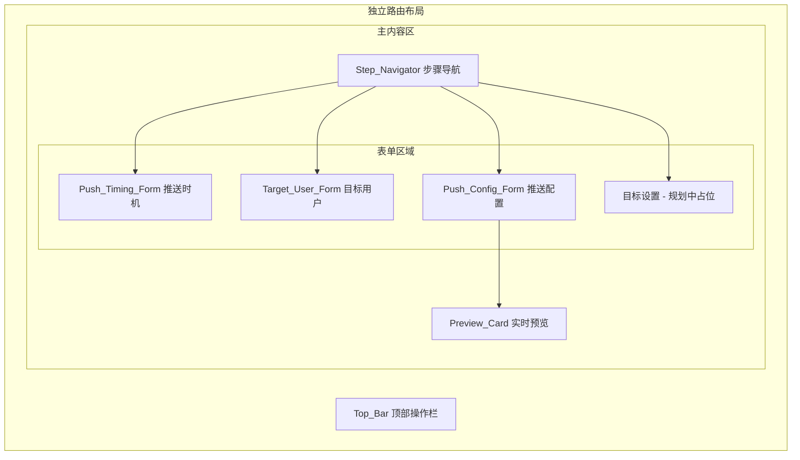
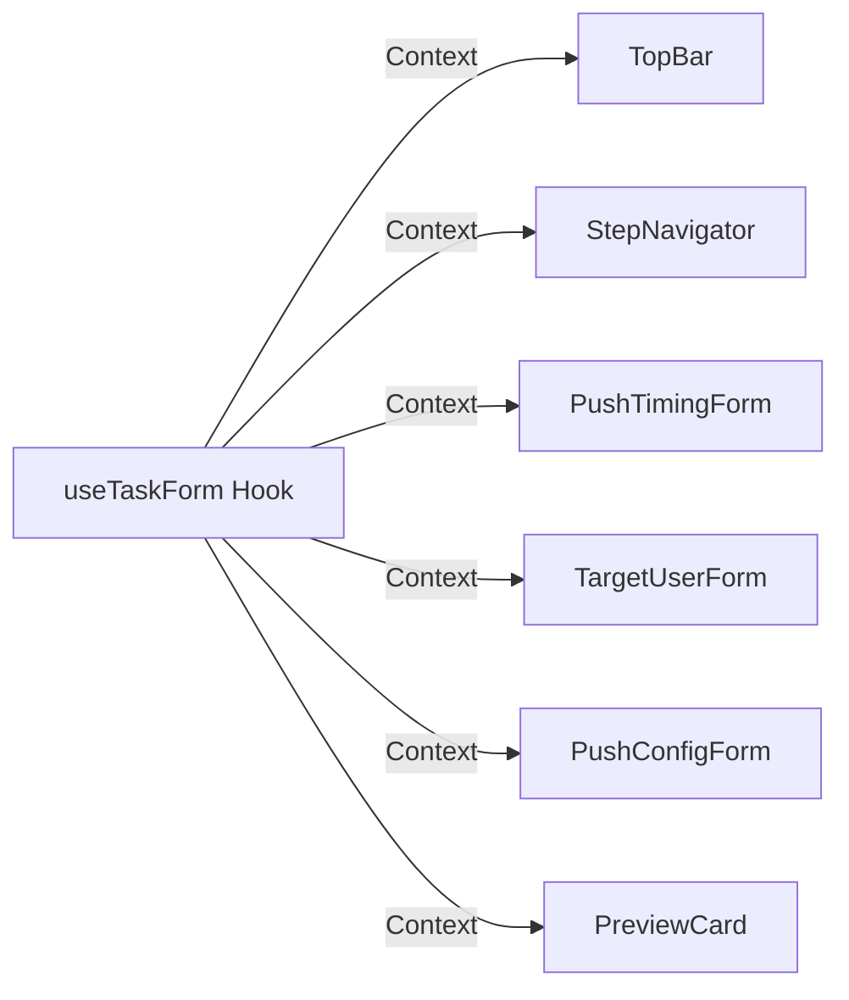

# Design Document: 新建推送任务页面 (create-push-task)

## Overview

本设计实现「新建推送任务」全屏表单页面。用户从 Task_List_Page 点击「+创建任务」进入独立路由 `/tasks/create`，通过4步向导（推送时机 → 目标用户 → 推送配置 → 目标设置）完成推送任务创建并保存为草稿。

页面采用独立布局（不嵌套主布局的侧边栏/顶部导航），包含：
- 顶部操作栏（返回、任务名称、取消、保存）
- 左侧步骤导航（4步，步骤4为规划中状态）
- 右侧表单内容区（根据当前步骤动态渲染）
- 推送配置步骤中的实时预览卡片

技术栈：React 18 + Ant Design 5 + React Router 6 + axios，后端 Go (Gin + GORM + PostgreSQL)。

## Architecture

### 页面级架构



### 路由架构

当前路由使用 `createBrowserRouter`，所有页面嵌套在 `<App />` 布局下。新建推送任务页面需要独立布局（隐藏侧边栏和顶部导航），因此在路由配置中作为顶层路由添加，不嵌套在 `<App />` 下。

```jsx
// router.jsx 新增
{ path: 'tasks/create', element: <CreatePushTask /> }  // 顶层路由，独立布局
```

### 状态管理架构

使用 React 自定义 Hook `useTaskForm` 集中管理所有表单状态，通过 Context 向子组件分发。



## Components and Interfaces

### 组件树

```
CreatePushTask (页面根组件)
├── TopBar
│   ├── BackButton
│   ├── TaskNameInput
│   ├── SystemLink
│   ├── CancelButton
│   └── SaveButton
├── StepNavigator
└── StepContent (条件渲染)
    ├── PushTimingForm
    │   ├── PushTypeSelector (5种类型单选)
    │   ├── ScheduleOnceForm (定时-单次)
    │   ├── ScheduleRepeatForm (定时-重复)
    │   ├── TriggerAForm (触发-完成A)
    │   │   └── EventCombinationForm
    │   ├── TriggerABForm (触发-完成A后未完成B)
    │   │   └── EventCombinationForm
    │   └── TopicForm (topic)
    ├── TargetUserForm
    │   ├── AttributeFilterList
    │   │   └── AttributeFilterRow (动态行)
    │   ├── BehaviorPlaceholder (禁用占位)
    │   └── EstimateButton
    ├── PushConfigForm
    │   ├── ABExperimentSelector (非AB/AB规划中)
    │   ├── NotificationContent
    │   │   ├── TemplateSelector
    │   │   ├── TitleInput (+插入参数)
    │   │   ├── ContentInput (+插入参数)
    │   │   └── ImageConfig
    │   ├── ClickActionConfig
    │   ├── NotificationStyleConfig
    │   └── PreviewCard (固定右侧)
    └── GoalPlaceholder (步骤4占位)
```

### 核心 Hook: useTaskForm

```typescript
interface TaskFormState {
  taskName: string;
  currentStep: number;
  completedSteps: Set<number>;

  // 步骤1: 推送时机
  pushType: 'schedule_once' | 'schedule_repeat' | 'trigger_a' | 'trigger_ab' | 'topic';
  scheduleOnce: { date: string; time: string };
  scheduleRepeat: {
    cycle: 'daily' | 'weekly' | 'monthly';
    weekDays: number[];
    monthDays: number[];
    time: string;
    endDate: string | null;
  };
  triggerA: {
    startDate: string;
    endDate: string;
    events: EventItem[];
    globalFilters: FilterCondition[];
    deliveryTiming: 'immediate' | 'delay';
    delayValue: number;
    delayUnit: 'minutes' | 'hours' | 'days';
    frequencyEnabled: boolean;
    frequency: { daily: number; weekly: number; monthly: number; intervalMinutes: number };
  };
  triggerAB: {
    /* 继承 triggerA 所有字段 */
    bEvent: string;
    timeWindow: number;
    timeWindowUnit: 'hours' | 'days';
  };
  topic: string;

  // 步骤2: 目标用户
  attributeFilters: AttributeFilter[];

  // 步骤3: 推送配置
  experimentType: 'none' | 'ab_planned';
  contentTemplate: string;
  notificationTitle: string;
  notificationContent: string;
  notificationImage: { type: 'custom' | 'url'; url: string };
  clickAction: 'open_app' | 'open_link';
  clickLink: string;
  style: {
    basic: 'normal' | 'floating';
    expandType: 'disabled' | 'text' | 'large_image' | 'bg_image' | 'bg_color' | 'right_image';
    sound: string;
    vibrate: boolean;
  };
}

interface EventItem {
  id: string;
  eventName: string;
  filters: FilterCondition[];
}

interface FilterCondition {
  id: string;
  field: string;
  operator: string;
  value: string | string[];
  logic: 'and' | 'or';
}

interface AttributeFilter {
  id: string;
  field: string;
  operator: string;
  value: string | string[];
  logic: 'and' | 'or';
}
```

### useTaskForm Hook 接口

```typescript
function useTaskForm() => {
  state: TaskFormState;
  setTaskName: (name: string) => void;
  setCurrentStep: (step: number) => void;
  markStepCompleted: (step: number) => void;
  updatePushTiming: (field: string, value: any) => void;
  updateTargetUser: (field: string, value: any) => void;
  updatePushConfig: (field: string, value: any) => void;
  addEvent: () => void;
  removeEvent: (eventId: string) => void;
  addAttributeFilter: () => void;
  removeAttributeFilter: (filterId: string) => void;
  validateCurrentStep: () => { valid: boolean; errors: ValidationError[] };
  resetPushTypeFields: (newType: string) => void;
  getSubmitPayload: () => CreateTaskPayload;
}
```

### 组件 Props 接口

```typescript
// TopBar
interface TopBarProps {
  taskName: string;
  onTaskNameChange: (name: string) => void;
  onBack: () => void;
  onCancel: () => void;
  onSave: () => Promise<void>;
  saving: boolean;
}

// StepNavigator
interface StepNavigatorProps {
  currentStep: number;
  completedSteps: Set<number>;
  onStepClick: (step: number) => void;
}

// PushTimingForm
interface PushTimingFormProps {
  pushType: string;
  formData: TaskFormState;
  onChange: (field: string, value: any) => void;
  errors: Record<string, string>;
}

// TargetUserForm
interface TargetUserFormProps {
  filters: AttributeFilter[];
  onAddFilter: () => void;
  onRemoveFilter: (id: string) => void;
  onFilterChange: (id: string, field: string, value: any) => void;
  onEstimate: () => Promise<void>;
  estimatedCount: number | null;
  estimating: boolean;
  errors: Record<string, string>;
}

// PreviewCard
interface PreviewCardProps {
  title: string;
  content: string;
  imageUrl: string;
  style: TaskFormState['style'];
}
```

## Data Models

### 前端表单数据 → API 请求映射

前端 `TaskFormState` 通过 `getSubmitPayload()` 转换为后端 API 所需的 `CreateTaskRequest`：

```typescript
interface CreateTaskRequest {
  project_id: number;
  task_name: string;
  push_type: string;
  status: 'draft';
  push_timing_config: PushTimingConfig;
  target_user_config: TargetUserConfig;
  push_content_config: PushContentConfig;
}

interface PushTimingConfig {
  push_type: string;
  schedule_once?: { date: string; time: string; timezone: 'user' };
  schedule_repeat?: {
    cycle: string;
    week_days?: number[];
    month_days?: number[];
    time: string;
    end_date?: string;
  };
  trigger_a?: {
    start_date: string;
    end_date: string;
    events: Array<{ event_name: string; filters: FilterCondition[] }>;
    global_filters: FilterCondition[];
    delivery_timing: string;
    delay_value?: number;
    delay_unit?: string;
    frequency_enabled: boolean;
    frequency?: { daily: number; weekly: number; monthly: number; interval_minutes: number };
  };
  trigger_ab?: {
    /* 继承 trigger_a */
    b_event: string;
    time_window: number;
    time_window_unit: string;
  };
  topic?: string;
}

interface TargetUserConfig {
  filters: Array<{
    field: string;
    operator: string;
    value: string | string[];
    logic: 'and' | 'or';
  }>;
}

interface PushContentConfig {
  experiment_type: string;
  template: string;
  title: string;
  content: string;
  image?: { type: string; url: string };
  click_action: string;
  click_link?: string;
  style: {
    basic: string;
    expand_type: string;
    sound: string;
    vibrate: boolean;
  };
}
```

### 后端数据模型（新增 push_task 表）

复用现有 `campaign` 模型模式，新增 `PushTask` 模型：

```go
// PushTask 推送任务
type PushTask struct {
    TaskID            int64          `json:"task_id" gorm:"primaryKey;autoIncrement"`
    ProjectID         int64          `json:"project_id" gorm:"not null"`
    TaskName          string         `json:"task_name" gorm:"not null"`
    PushType          string         `json:"push_type" gorm:"not null"`
    Status            string         `json:"status" gorm:"default:'draft'"`
    PushTimingConfig  JSONB          `json:"push_timing_config" gorm:"type:jsonb"`
    TargetUserConfig  JSONB          `json:"target_user_config" gorm:"type:jsonb"`
    PushContentConfig JSONB          `json:"push_content_config" gorm:"type:jsonb"`
    Creator           string         `json:"creator" gorm:"not null"`
    CreateTime        time.Time      `json:"create_time" gorm:"autoCreateTime"`
    UpdateTime        time.Time      `json:"update_time" gorm:"autoUpdateTime"`
}
```

### API 接口设计

遵循现有 `/api/v1/` 前缀和 Gin 路由风格：

| 方法 | 路径 | 说明 |
|------|------|------|
| POST | `/api/v1/tasks` | 创建推送任务（草稿保存） |
| PUT | `/api/v1/tasks/:taskId` | 更新推送任务 |
| GET | `/api/v1/tasks/:taskId` | 获取推送任务详情 |
| GET | `/api/v1/tasks` | 获取任务列表（已有） |
| POST | `/api/v1/tasks/estimate` | 预估目标用户数 |
| GET | `/api/v1/tasks/topics` | 获取可用 topic 列表 |
| GET | `/api/v1/tasks/events` | 获取可用事件列表 |
| GET | `/api/v1/tasks/templates` | 获取内容模板列表 |
| POST | `/api/v1/upload/image` | 上传通知图片 |

#### POST /api/v1/tasks 请求/响应

```json
// Request
{
  "project_id": 1,
  "task_name": "春节活动推送",
  "push_type": "schedule_once",
  "push_timing_config": { ... },
  "target_user_config": { ... },
  "push_content_config": { ... }
}

// Response 200
{
  "task_id": 123,
  "message": "Task saved as draft"
}

// Response 400
{
  "error": "task_name is required",
  "field": "task_name"
}
```

#### POST /api/v1/tasks/estimate 请求/响应

```json
// Request
{
  "project_id": 1,
  "filters": [
    { "field": "platform", "operator": "=", "value": "iOS", "logic": "and" }
  ]
}

// Response 200
{
  "estimated_count": 15230
}
```

